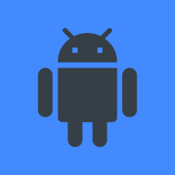

# Progressive Web App - Mobile Game Engine

See working example [here](https://iconejey.github.io/pwa-mge/).

## Project structure example:

```
project
├───index.html
├───style.css
├───main.js
├───img
│    ├───icon192.png
│    └───icon512.png
└───manifest.html
```

## Required for head:

```html
<!-- [Optional] App compatibility and display -->
<!-- [Optional] App compatibility and display adaptation -->
<meta name="viewport" content="width=device-width, initial-scale=1.0, minimum-scale=1.0, maximum-scale=1.0, viewport-fit=cover" />
<meta name="mobile-web-app-capable" content="yes" />
<meta name="apple-mobile-web-app-capable" content="yes" />

<!-- [Optional] Theme color / icon -->
<meta name="theme-color" content="#181818" />
<meta name="color-scheme" content="dark" />
<link rel="shortcut icon" href="./img/icon512.png" type="image/x-icon" />
<link rel="apple-touch-icon" href="./img/icon192.png" />

<!-- [Required] Manifest and stylesheet -->
<link rel="manifest" href="./manifest.json" />
<link rel="stylesheet" href="./mge.css" />
<link rel="stylesheet" href="./style.css" />
```

## Required for body:

```html
<!-- [Required] Mobile Game Engine Element -->
<div class="mge-main">
	<!-- [Required] Game canvas -->
	<canvas></canvas>

	<!-- [Required] Touch screen -->
	<div class="tactile">
		<span class="joystick left base"></span>
		<span class="joystick left tip"></span>

		<span class="joystick right base"></span>
		<span class="joystick right tip"></span>
	</div>

	<!-- [Required] Sections shown over canvas using mge.setOverlay(id) -->
	<div class="mge-overlay">
		<!-- [Required] Blank section -->
		<section id="blank">
			<a class="button" onclick="alert('button')">Button</a>
		</section>

		<!-- [Required] Lanscape opaque section -->
		<section id="landscape" class="opaque">
			<p>Over the canvas when screen not held in landscape mode.</p>
		</section>

		<!-- [Required] Fullscreen opaque section -->
		<section id="fullscreen" class="opaque">
			<p>Over the canvas when game not in fullscreen and mge.forceFulscreen is true.<br />Tap on screen to go fullscreen.</p>
		</section>

		<!-- [Optional] Custom transparent section -->
		<section id="example">
			<p>Example of custom overlay.</p>
			<a onclick="mge.setOverlay(null)">[exit]</a>
			
		</section>
	</div>
</div>

<!-- [Optional] Cookie tools -->
<script src="./cookie.js"></script>

<!-- [Required] Mobile Game Engine -->
<script src="./mge.js"></script>

<!-- [Required] Main script -->
<script src="./main.js"></script>
```

## style.css example use:

```css
/* Html */
html {
	background-color: #181818;
	font-family: monospace;
}

/* Style applied to canvas */
.mge-main canvas {
	height: 200vh;
}

/* Style applied to canvas when the example section is shown */
.mge-main canvas.on-example-section {
	filter: blur(5px);
}

/* Style applied to example section image */
.mge-overlay section#example img {
	position: absolute;
	width: 64px;
	left: 50%;
	top: 50%;
	border-radius: 20%;
	transform: translate(-50%, -50%);
}

/* Button shown over canvas */
a.button {
	position: absolute;
	background-color: #fff2;
	left: 50vw;
	top: 80vh;
	transform: translateX(-50%);
	padding: 2vh 3vh;
	font-size: 8vh;
	font-family: monospace;
	border-radius: 2vh;
	outline: none;
	user-select: none;
}

/* Opaque sections's background */
.mge-overlay section.opaque {
	background-color: #181818;
}
```

## main.js example use:

```js
// Setting left joystick as fixed with 0.2 min opacity
mge.joysticks.L.base.fixed = true;
mge.joysticks.L.base.opacity.min = 0.2;
mge.joysticks.L.tip.opacity.min = 0.2;

// Example player object
let player = { x: 128, y: 128, s: 1 };

// Activating joysticks after 1s
setTimeout(_ => mge.joysticks.forEach(j => j.setActive(true)), 1000);

// Showing example section on left-joystick tap
mge.joysticks.L.onTap = j => mge.setOverlay('example');

// Make player jump to the zone tapped with right-joystick
mge.joysticks.R.onTap = j => (player = { ...player, ...mge.toGameCoords(j.tip) });

// Move player with left-joystick push
mge.joysticks.L.onPush = j => {
	player.x += (j.pos.x * player.s * delay) / 20;
	player.y += (j.pos.y * player.s * delay) / 20;
};

// Left-joystick hold position
let hold_pos;

// Set left-joystick free on hold and remember position
mge.joysticks.L.onHoldStart = j => {
	hold_pos = { ...j.tip };
	j.base.fixed = false;
};

// Move camera with left-joystick hold
mge.joysticks.L.onHold = j => {
	let new_pos = { ...j.tip };
	let x = player.x - ((new_pos.x - hold_pos.x) / mge.elem.clientHeight) * 200;
	let y = player.y - ((new_pos.y - hold_pos.y) / mge.elem.clientHeight) * 200;
	mge.camera.set({ x: x, y: y, z: 128 }, 0.05);
};

// Set left-joystick fixed when holding ends and reposition it
mge.joysticks.L.onHoldEnd = j => {
	j.base.fixed = true;
	j.position();
};

// Make player sprint on Right-joystick hold
mge.joysticks.R.onHoldStart = j => (player.s = 2);
mge.joysticks.R.onHoldEnd = j => (player.s = 1);

// Make player slow down on Right-joystick push
mge.joysticks.R.onPushStart = j => (player.s = 0.5);
mge.joysticks.R.onPushEnd = j => (player.s = 1);

// Logic loop
mge.logic = _ => {
	// Fps count
	document.querySelector('span#fps').innerHTML = Math.floor(1000 / delay);
};

// Graphics loop
mge.graphics = _ => {
	// Clear canvas
	mge.clear();

	// Smoothly follow player with camera
	if (!mge.joysticks.L.tip.held) mge.camera.set({ ...player, z: 100 }, 0.05);

	// Draw background
	mge.ctx.drawImage(imgs['default_background'], 0, 0);

	// Draw player
	mge.ctx.fillStyle = 'white';
	let x = Math.floor(player.x);
	let y = Math.floor(player.y);
	mge.ctx.fillRect(x, y, 1, 1);
};

// Game images
let imgs = [];

// Loading images
mge.loadImg(
	// In
	['./img/default_background.png'],
	// Out
	imgs,
	// When an image loaded
	p => console.log('loading ' + Math.floor(100 * p) + '%'),
	// If an error occurs
	src => console.error('Could not load ' + src),
	// When all images loaded
	_ => {
		// Set canvas size
		let bg = imgs['default_background'];
		mge.canvas.width = bg.width;
		mge.canvas.height = bg.height;

		// Camera on player
		mge.camera.set({ ...player, z: 100 }, 1);

		// Main loop
		mge.start();
	}
);
```

## manifest.json example:

```json
{
	"name": "Mobile Game",
	"short_name": "Mobile Game",

	"start_url": "https://mygame.com/",
	"display": "fullscreen",
	"orientation": "landscape",

	"background_color": "white",
	"theme_color": "white",

	"icons": [
		{
			"src": "img/icon192.png",
			"sizes": "192x192",
			"type": "image/png",
			"purpose": "maskable"
		},
		{
			"src": "img/icon512.png",
			"sizes": "512x512",
			"type": "image/png",
			"purpose": "maskable"
		}
	]
}
```
